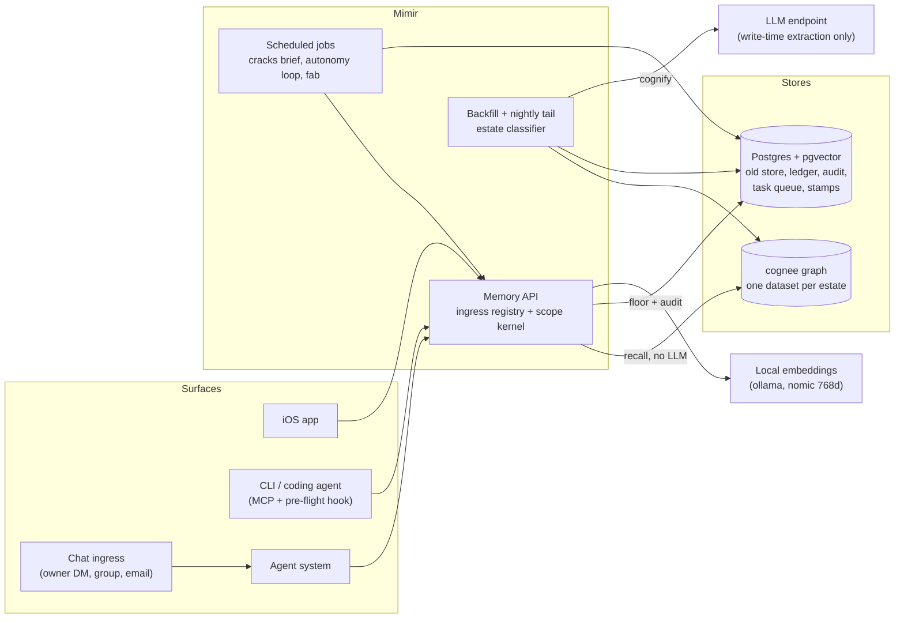

# Mimir

A memory and cognition layer for a personal AI agent setup: one recall API that every chat surface, CLI and scheduled job goes through, with work and personal memory walled apart at storage and opened only by rules the model cannot argue with.

This is a sanitized portfolio copy of a private, running system. Client names, personal data and private integrations are removed or replaced with invented examples. The engineering is unchanged.

## Design laws

Every spec in `specs/` cites these by number.

1. Draft, never auto-send. Trust is earned over weeks, not assumed.
2. Real-time paths are deterministic rules. Reasoning is one batched pass per day.
3. Expose a curated subset of entities to any LLM, never everything.
4. Money and irreversible actions stay at the highest approval tier, always.
5. Prompt injection is the main agent exploit. Never auto-act on untrusted input.
6. Retrieval is not judgment. "What did I write" is RAG; "what did I drop" is a database query.
7. Durable builds are boring glue (timers, APIs, SQL). One brain and many tools, no multi-agent sprawl.

## Context



The LLM endpoint sits on the write path only. Reads embed the query locally and return graph facts and passages without a completion call.

## Components

| Component | Path | What it does | Status |
|---|---|---|---|
| Recall API and scope kernel | `jobs/memory-api/` | FastAPI service. Ingress registry, scope minting, recall fan-out across per-estate datasets, pgvector floor over the old store, write path, recency stamps, audit log, MCP bridge for coding agents. | Real code. 33 security tests. |
| Spine migration | `jobs/memory-migration/` | Estate classifier, provenance tuple, budget-capped backfill with a per-unit ledger, nightly shadow tail, the embedding-engine fix, parity and leak probes. | Real code. |
| Bake-off harness | `jobs/memory-spine-bakeoff/` | Two contenders (pgvector hybrid search, cognee graph), an LLM-as-judge with ground truth, report generator. | Real code. Corpus, queries and results withheld. |
| Autonomy loop | `jobs/autonomy/` | Deterministic producer, one daily digest, approve/reject/snooze CLI, audit-first executor, revert. First domain: task triage. | Real code. The gate functions it calls (`ops.can_auto_execute`, `ops.revert`) live in database migrations not included here. |
| Cracks brief | `jobs/cracks-brief/` | Daily "what is falling through the cracks" brief with deterministic scoring and one-tap done/snooze/dismiss buttons. | Real code. Depends on SQL functions not included here. |
| Fab | `jobs/fab/` | Text or voice to 3D print: generate or retrieve a model, slice, lint the G-code, propose, print only after two human approvals. | Real code, with an offline slice test suite. |
| Pre-flight hook | `jobs/preflight-hook/` | Coding-agent prompt hook. String-matches known entities and injects one "last changed" line per hit. Fail-open, no LLM. | Thin (one stdlib script). |
| Recency-stamp producers | `specs/08-routing-retrieval.md` | Mail and messaging producers that emit "entity X changed, look here" stamps. | Spec only in this copy. The stamps API and its migrations are included. |
| Graduation recommender | `specs/09-autonomy-loop.md` §4.6 | Computes per-domain approval records and recommends a trust raise in the digest. | Spec only. |

## Bake-off: graph versus vectors

Before migrating anything, I measured whether a knowledge graph earns its cost over the existing pgvector hybrid search.

Method:

- Corpus: the 7 densest work meeting documents (people, dates, commitments, blockers). Private, not included.
- 16 queries in 4 classes of 4: factual, relational, temporal, cross-source.
- Scored 0, 1 or 2 per query at k=5 by an LLM judge given the ground truth, one standard across all systems.
- Decision rule committed before the run: adopt the graph only if it beats the incumbent by at least 30% on the relational and temporal queries.
- Fairness control "A+RAG": the incumbent's top-5 chunks fed to the same LLM cognee uses. This holds the synthesis model constant, so the comparison isolates retrieval.

First run, mean score out of 2:

| Class | Incumbent retrieval | A+RAG | cognee graph |
|---|---:|---:|---:|
| Factual | 0.75 | 1.00 | 2.00 |
| Relational | 1.00 | 0.50 | 1.50 |
| Temporal | 0.75 | 0.25 | 1.50 |
| Cross-source | 1.25 | 1.25 | 1.75 |
| Relational + temporal | 0.88 | 0.38 | 1.50 |
| All 16 | 0.94 | 0.75 | 1.69 |

The graph beat the incumbent by 71% on relational + temporal and beat A+RAG by 300%, so the graph, not the LLM, made the difference.

Re-run under one judge. The first run was judged by Claude. A later harness judged with Gemini, and scoring the same cognee answers with the two judges gave 1.69 against 0.94. The judge also varied at temperature 0 (one query flipped across repeats), so every item was judged three times and the median kept. With one judge for all systems:

| Class | Incumbent | cognee, flash | cognee, flash-lite |
|---|---:|---:|---:|
| Relational + temporal | 0.50 | 0.75 | 0.75 |
| All 16 | 0.56 | 0.94 | 0.88 |

The win shrank from +71% to +50%, still past the 30% bar. The cheaper extraction model tied on the deciding band, which cut the full backfill estimate from about $164 to about $29 for 25,811 chunks.

## Recall security model

The rules live in `jobs/memory-api/ingress.py`, `scope.py` and `write.py`.

- Scope comes from the authenticated ingress, never from the LLM and never from message text. A caller presents a registered ingress name and its key. The registry decides which estates (personal, work, shared, work_confidential) that surface may read. An unregistered ingress gets nothing.
- Content may narrow scope, never widen it. Narrowing intersects with what the ingress holds, so widening cannot be expressed.
- Untrusted principals (a chat group with other members, inbound email) get an empty scope. They cannot read memory and cannot write it. A hostile group message containing the escalation verb is still refused.
- Escalation to cross-estate recall needs an owner-strong ingress plus a verb parsed by deterministic router code. It never includes confidential material.
- Surfaces whose model provider logs prompts can never hold work scope.
- Confidential material returns pointers only: a title and "retrieve the source directly". Its body was never sent to any LLM at ingest.
- No LLM calls at read time. Recall embeds the query locally and asks the graph for context only, so work context reaches no provider during recall.
- Every request, allowed or denied, is written to an audit table with the query stored as a SHA-256 hash.
- Stamp producers are write-only: they can post recency hints for their own estate and cannot read.

`test_scope.py` holds 26 attack tests and `test_write.py` holds 7. Each one is an exploit attempt that must stay refused.

## Autonomy invariants

From `specs/09-autonomy-loop.md` §5 and the code in `jobs/autonomy/`:

- Propose first. Producers are deterministic and write proposals, not actions.
- One digest per day. Proposals batch into a single message with approve, reject and snooze.
- Approve before execute. The executor only touches rows the owner approved.
- Audit-first execution. The proposal and the approval are audited before the executor acts. The executed audit row is written first in the transaction that records the result, and every executed row stores a revert action. The action list is closed: an unknown action is refused and audited.
- Revert is a first-class command and must be proven on a domain before it can graduate.
- A global kill switch drops every domain to propose with one config write. It shipped off.
- Trust rises only by owner declaration. The loop may recommend a raise (rolling 30 days, at least 10 decided proposals, at least 95% approved, zero reverts) but no code path writes the trust level.
- Money and irreversible actions always propose. Physical and security actuators (the printer, home security) are capped at propose permanently.

## Lessons learned

**The "422" was a timeout in disguise.** cognee's embedding path against a local ollama failed with status 422. Ollama never sent a 422. It was the default status code on cognee's own `EmbeddingException`, wrapping an `asyncio.TimeoutError`. Three bugs stacked: the engine fired a whole batch of 36 requests at once at a server that processes one at a time, the HTTP timeout was hardcoded at 60 seconds, and the retry path only reacted to the text "context length" in the error, while `str(TimeoutError())` is empty. `nomic_engine.py` adds bounded concurrency, client-side truncation, a configurable timeout and retries, and fails loudly instead of writing a zero vector. Before the fix, 4 of 11 adversarial cases failed; after it, all 11 pass in 9.6 seconds.

**The access-control flag was load-bearing.** With cognee's backend access control off, the `datasets=[...]` argument is ignored and every search runs against one global store. A personal-scope query, "who owns the scheduling workstream?", returned a work colleague's name. Turning it on gives each estate its own vector and graph database. The cost is that one graph answer can never span estates.

**The estate classifier leaked four ways, each found by reading data, not by a test.**

- A "work vault path" rule was written as a prefix match, so 171 work notes under a nested `Memory/Work/` folder were labelled personal. It now matches a path component.
- A short work keyword matched inside ordinary words (in the example config, `rota` inside `rotation`), mislabelling 262 personal documents. Word boundaries fixed that, and then `\b` treated `-` as a boundary and matched a hardware model name. Hyphenated identifiers are now scrubbed before matching.
- Splitting mixed documents by section dropped the `[Work/...]` header from sections 1..N, sending about 1,580 work fragments to personal recall. Provenance is now decided once per document and inherited by every section.
- The header regex required a slash straight after the folder name, so `[WorkMemory/...]` headers slipped through, and a personal namespace was trusted over its content. 281 work rows were filed personal. Both guards together catch all 281.

**Measure the judge before trusting the score.** The same answers scored 1.69 under one judge and 0.94 under another. A 10% gate cannot be enforced with an instrument that flips a query between runs.

**A precise producer beats a clever one.** The first autonomy dry-run week had close to 0% precision. Half the candidate pool was assigned to someone else and much of it was stale. Deterministic gating (owner-assigned, idle under 7 days, a real task, not already tracked) cut the routes from 10 to 4, all owned by the owner.

## What is not included, and why

- Personal and work data: notes, memory rows, transcripts, the provenance ledger, audit rows. They are private.
- Private integrations: the mail and messaging stamp producers, the agent system's chat transports, and the database migrations outside the stamps table (task queue, trust engine, kill switch, cracks functions). They are coupled to a private schema and accounts.
- The bake-off corpus, queries, ground truth and raw answers. They are client meeting content. Only aggregate scores appear above.
- Specs 04, 06 and 10 cover separate projects.
- Real estate term lists. `jobs/memory-migration/estates.example.json` ships invented terms (employer "initech", client "Acme Health", colleague "Sam Patel"). Put real ones in `estates.json`, which is gitignored, or point `MIMIR_ESTATES_FILE` at them.

Configuration placeholders are in `.env.example`. Third-party packages are in `requirements.txt`.

## Running the memory API tests

The security tests need no database or network.

```bash
python3 -m venv .venv
.venv/bin/pip install pytest psycopg2-binary
cd jobs/memory-api
PYTHONPATH=. ../../.venv/bin/python -m pytest test_scope.py test_write.py
```

Expected: 33 passed.

## Author

Built by Ahmed Arafa.

## License

Copyright (c) 2026 Ahmed Arafa. All rights reserved. Source is published for review; no license is granted.
